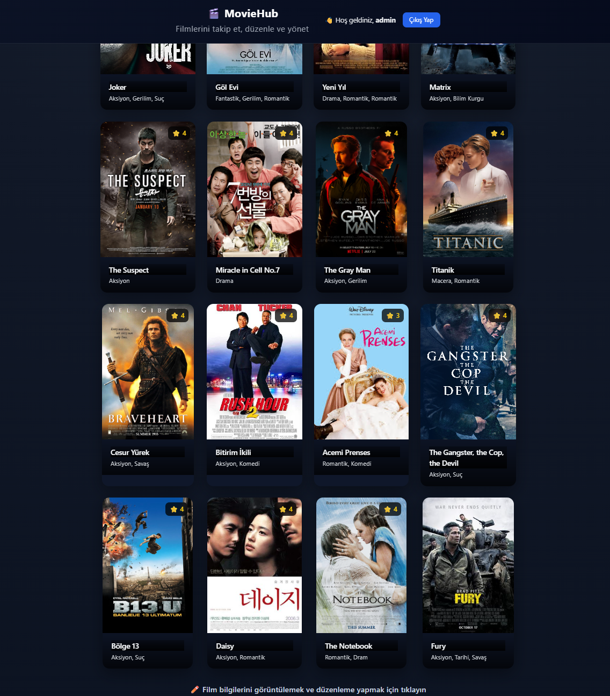

# MovieHub – Spring Boot MVC Movie Watchlist Application

MovieHub, kullanıcıların filmleri takip edebildiği, ekleyip düzenleyebildiği ve yönetebildiği  
**Spring Boot MVC tabanlı** bir web uygulamasıdır. Proje, 
**backend, frontend ve test süreçlerini kapsayacak şekilde** geliştirilmiştir.

Uygulama, yalnızca teknik işlevleri değil; **kullanıcı deneyimini (UX)** de ön planda tutacak biçimde tasarlanmıştır.

---

## Kullanılan Teknolojiler
- Java 17  
- Spring Boot (MVC)  
- Spring Data JPA  
- Thymeleaf  
- MySQL  
- HTML / CSS / Bootstrap  
- Maven  
- JUnit 5 & MockMvc  

---

## Giriş Bilgileri (Demo)
> Test ve demo amaçlıdır.

- **Kullanıcı Adı:** admin  
- **Şifre:** 123  

---

## Uygulanan Test Türleri

Bu projede **8 farklı test türü** uygulanmıştır:

1. Unit Test (Birim Testi)  
2. Integration Test (Entegrasyon Testi)  
3. UI Test (Arayüz Testi)  
4. Regression Test (Regresyon Testi)  
5. End-to-End Test (Uçtan Uca Test)  
6. User Acceptance Test (Kullanıcı Kabul Testi)  
7. Smoke Test  
8. System Test (Sistem Testi)  

> Tüm testler `src/test/java` altında paketlenmiş şekilde bulunmaktadır.

---

## Uygulama Özellikleri
- Kullanıcı girişi (Login)
- Film ekleme / düzenleme / silme (CRUD)
- Film arama
- Türlere göre filtreleme
- İzlenme durumu ve puanlama
- Film görseli yükleme
- Yönetim paneli (Film Yönetimi)
- Film kartlarına tıklandığında **doğrudan izleme bağlantısına yönlendirme**
- Film ekleme sırasında izleme linki tanımlama ve  
  izlenen veya ileride izlenecek filmler için kısa kullanıcı notları ekleme

---

## Kullanıcı Deneyimi (UX) Odaklı Tasarım

Uygulama, **gerçek kullanıcı senaryoları** dikkate alınarak geliştirilmiştir:

- CRUD işlemleri (ekleme, güncelleme, silme) sonrasında  
  kullanıcıya **arayüz üzerinden anlık bildirimler** gösterilir  
  (örn: *“Film başarıyla eklendi”, “Film güncellendi”, “Film silindi”*).

- Butonlar, yönlendirmeler ve formlar kullanıcıya  
  **“gerçek bir web uygulaması” hissi** verecek şekilde tasarlanmıştır.

- Film kartlarına tıklandığında izleme linkine yönlendirme yapılması,  
  uygulamanın **film platformu deneyimini** güçlendirmektedir.

---

## Ekran Görüntüleri

Uygulamanın çalışır hâline ait ekran görüntüleri  
`screenshots/` klasörü altında yer almaktadır.

Örnek olarak aşağıdaki ekranlar yer almaktadır:
- Admin / Film Yönetimi ekranı  
- Film ekleme formu  
- Film güncelleme ekranı  
- CRUD işlemleri sonrası kullanıcı bildirimleri  

### Admin Dashboard & Movie Management


### Movie Update – Success Notification


---

## Proje Klasör Yapısı

```text
moviehub-spring-boot-mvc
├── src
│   ├── main
│   │   ├── java        # Application source code
│   │   └── resources  # Templates, static files
│   └── test
│       └── java        # Unit, integration, UI and system tests
├── screenshots         # Application UI screenshots
├── .gitignore          # Git ignore rules
├── .gitattributes      # Git configuration
├── mvnw                # Maven Wrapper (Unix)
├── mvnw.cmd            # Maven Wrapper (Windows)
├── pom.xml             # Maven project configuration
└── LICENSE             # MIT License
```

## Notlar
- `application.properties` dosyası güvenlik nedeniyle repoya eklenmemiştir.
- Örnek yapı için `application-example.properties` kullanılabilir.
- Bu proje, modern web uygulamalarında kullanılan mimari,
  test stratejileri ve kullanıcı deneyimi yaklaşımlarını
  uygulamalı olarak göstermek amacıyla geliştirilmiştir.
---

## Geliştirici
**Sultan Tazefidan**  
